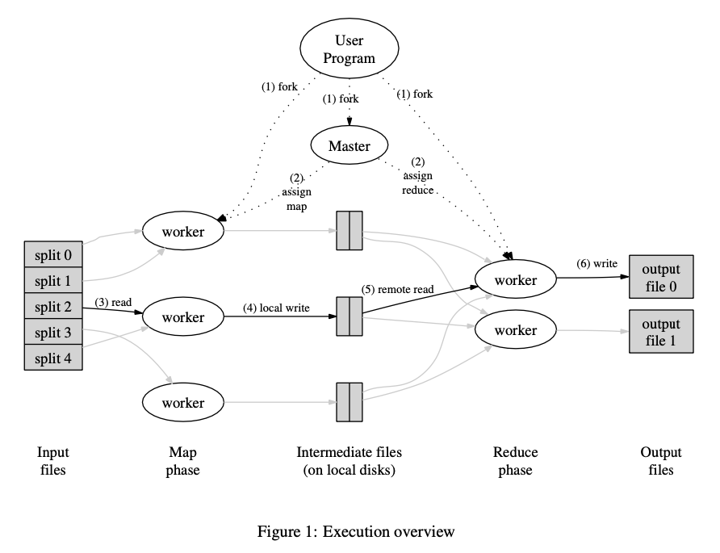

# MIT6.824/6.5840 Distributed System 2023

[6.824/6.5840 Course Link](https://pdos.csail.mit.edu/6.824/)

## Lab

Lab 1: Distributed big-data framework (like MapReduce)
Lab 2: Fault Tolerance using replication (Raft)
Lab 3: a simple Fault-Tolerant database
Lab 4: Scalable database performance via sharding

## Lecture Note

### Google Map Reduce

[01-Intro](./Lecture/01-Intro.md)
[01-MapReduce Google](./Lecture/01-MapReduce.md)
[MapReduce: Simplified Data Processing on Large Clusters Google](./Paper/01-mapreduce.pdf)



### Concurrency in Go

[02-Threads_RPC](./Lecture/02-Threads_RPC.md)
[02-Go-Q&amp;A](./Lecture/02-faq.md)
[02-crawler.go](./Lecture/02-crawler.go)

```
go run Lecture/02-crawler.go
```

### Google File System

[03-GFS](./Lecture/03-GFS.md)
parallel Performance -> Sharding
Faults -> Tolerance -> Replication -> Consistency -> Low Performance
[03-Q&amp;A](./Lecture/03-faq.md)
